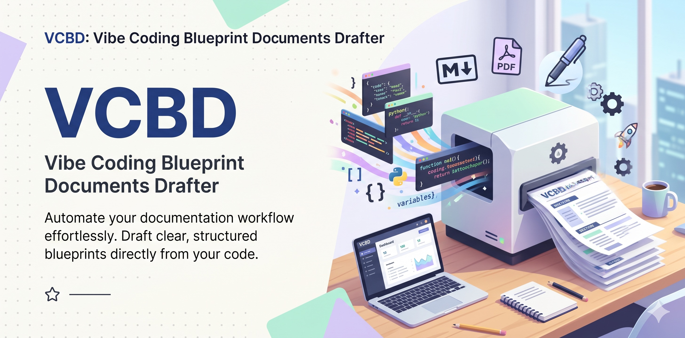

<p align="center">
  
</p>

# VCBD Suite — Vibe Coding Blueprint Drafter

**Lima skill Claude Code untuk seluruh siklus hidup aplikasi**: dari ide atau aplikasi warisan, menjadi blueprint terstruktur, menjadi kode yang dibangun slice demi slice, sampai kode yang diaudit, diuji, dan ditambal — semuanya dengan gerbang mesin, bukan harapan.

Suite 2026.10 · Bahasa Indonesia · Penulis: Syamsuddin · Lisensi: lihat [Lisensi](#lisensi)

---

## Daftar isi

1. [Gambaran besar](#gambaran-besar)
2. [Untuk orang awam](#untuk-orang-awam)
3. [Isi suite](#isi-suite)
4. [Paket blueprint 28+ dokumen](#paket-blueprint-28-dokumen)
5. [Rincian tiap skill](#rincian-tiap-skill)
   - [`vcbd`](#vcbd--penyusun-blueprint) · [`coding-vcbd`](#coding-vcbd--eksekutor-blueprint) · [`review-vcbd`](#review-vcbd--auditor--penambal) · [`reverse-vcbd`](#reverse-vcbd--pembedah-kode-warisan) · [`reverse-web-vcbd`](#reverse-web-vcbd--pembedah-kotak-hitam)
6. [Berkas state yang lahir di proyek](#berkas-state-yang-lahir-di-proyek)
7. [Pasang](#pasang)
8. [Cara pakai](#cara-pakai)
9. [Konvensi bersama](#konvensi-bersama)
10. [Struktur repo](#struktur-repo)
11. [Riwayat versi](#riwayat-versi)
12. [Lisensi](#lisensi)

---

## Gambaran besar

```
  aplikasi web lama ──► reverse-web-vcbd ─┐
  (hanya peramban)        bedah kotak hitam│
                                           ▼
  aplikasi lama ──────► reverse-vcbd ──► vcbd ──► coding-vcbd ──► review-vcbd
  (ada kode)             bedah &          blueprint   bangun         audit,
                         buktikan         28+ dok     per slice      uji, tambal
                                           ▲                            │
  ide baru ────────────────────────────────┘                            │
  (greenfield)                       temuan & perubahan ────────────────┘
                                     (Mode Pembaruan vcbd)
```

Dua kegagalan termahal dalam *vibe coding* bukan kode yang salah — itu murah diperbaiki — melainkan:

1. **Membangun hal yang salah**, karena kebutuhan tidak pernah digali.
2. **Dokumen yang saling bertentangan** (*document drift*): satu berkas bilang "pakai MySQL", berkas lain "pakai Postgres", dan agen AI memilih salah satunya secara acak.

VCBD menjawab keduanya dengan **"gali & konfirmasi dulu, baru tulis"** dan **"satu fakta, satu rumah"**, lalu menyambungkan blueprint itu ke pembangunan dan audit yang sama disiplinnya.

---

## Untuk orang awam

> Bayangkan Anda menyuruh tukang (AI seperti Claude Code) membangun rumah. **`vcbd` adalah pembuat gambar kerja** — lengkap, rapi, dan tidak saling bertentangan — supaya tukang tidak salah bangun. **`coding-vcbd` adalah mandor** yang memastikan rumah dibangun sesuai gambar, satu ruangan demi satu ruangan, dan tiap ruangan diperiksa sebelum lanjut. **`review-vcbd` adalah pengawas** yang memeriksa hasilnya dengan bukti, bukan dengan perasaan. Untuk rumah yang sudah berdiri tanpa gambar, **`reverse-vcbd`** dan **`reverse-web-vcbd`** mengukur ulang bangunannya lalu menggambar ulang gambar kerjanya.

| Prinsip | Artinya untuk Anda |
|---|---|
| 🚦 Tanya dulu, baru kerja | AI mewawancarai Anda dan **menunggu Anda bilang "ya"** sebelum menulis — tidak ada kejutan. |
| 🗂️ Satu fakta, satu rumah | Tiap info ditulis di **satu dokumen** saja; yang lain cukup menunjuk. Ubah sekali, beres. |
| 🔦 Buka seperlunya | `INDEX.md` menunjuk dokumen mana yang dibaca per pekerjaan — hemat token, AI tetap fokus. |
| 🎨 Tampilan tidak dikarang | Warna, huruf, dan ukuran dikunci di tabel token; "modern dan bersih" harus diterjemahkan jadi angka. |
| ✅ Selesai = diuji | "Selesai" berarti perintah uji dijalankan dan lulus (`validate.sh`, `gerbang.sh`, `pindai.py`), bukan "katanya sudah". |
| 🔍 Tidak ada klaim tanpa bukti | Temuan membawa `path:baris`; yang belum pasti diberi label `[ASUMSI]`/`[TERBUKA]`/`[USULAN]`. |
| 🛡️ Aman untuk proyek lama | Tidak asal menimpa berkas yang sudah ada; kalau dokumen beda dengan kode, **kode yang menang** dan AI wajib lapor. |

**Kapan cocok?** ✅ Aplikasi yang akan dipelihara, agak besar, banyak peran atau tabel, atau sistem lama yang mau dilanjutkan (di mana salah = mahal). ❌ Kurang cocok untuk prototipe sekali buang — paket dokumennya jadi kebanyakan.

---

## Isi suite

| Skill | Versi | Peran | Mulai dari sini bila… | Contoh pemicu |
|---|---|---|---|---|
| [`vcbd`](skills/vcbd/) | 2.6 | Menyusun paket blueprint 28+ dokumen dari wawancara bertahap | Aplikasi belum ada, baru ide | "siapkan blueprint lengkap aplikasi X" |
| [`coding-vcbd`](skills/coding-vcbd/) | 1.2 | Mengeksekusi blueprint menjadi aplikasi, satu vertical slice demi slice | Blueprint sudah ada, coding belum mulai | "mulai coding dari blueprint", "kerjakan fase 2 roadmap" |
| [`review-vcbd`](skills/review-vcbd/) | 1.2 | Mengaudit, menguji, melacak bug, dan menambal terhadap blueprint | Kode sudah ada, ingin tahu di mana ia menyimpang | "audit kode terhadap blueprint", "tambal TEM-003" |
| [`reverse-vcbd`](skills/reverse-vcbd/) | 1.0 | Membedah aplikasi brownfield (ada kode) menjadi dosir bukti lalu blueprint | Aplikasi sudah ada, dokumennya tidak ada | "buatkan blueprint dari kode yang sudah ada" |
| [`reverse-web-vcbd`](skills/reverse-web-vcbd/) | 2.0 | Membedah aplikasi web secara kotak hitam (HAR/HTML) jadi dosir & draf manifest | Aplikasinya hanya bisa dibuka lewat peramban | "bedah HAR ini", "tiru aplikasi vendor ini" |

---

## Paket blueprint 28+ dokumen

`vcbd` (dan `reverse-vcbd`) menghasilkan **28 dokumen inti** — `docs/00`–`25` ditambah `CLAUDE.md` dan `INDEX.md` di root — plus dua dokumen **kondisional**. Spesifikasi lengkap tiap dokumen ada di [`template-dokumen.md`](skills/vcbd/references/template-dokumen.md).

### Root proyek

| Berkas | Isi |
|---|---|
| `CLAUDE.md` | Inti selalu-aktif yang sangat ringkas: prinsip kerja agen, rujukan stack, perintah penting, guardrail inti, definisi selesai. |
| `INDEX.md` | Router konteks: jenis task → dokumen mana yang dimuat (*tiered loading*), plus aturan emas. Ditulis utuh oleh `scaffold.py`. |

### `docs/`

| Klaster | Dokumen |
|---|---|
| **Strategis (00–03)** | `00_EXECUTIVE_SUMMARY` — kenapa proyek ada · `01_PRD` — pemilik fitur (MVP vs later) · `02_SCOPE` — in-scope dan out-of-scope eksplisit · `03_ROADMAP` — fase berupa vertical slice yang bisa didemokan |
| **Domain (04–07)** | `04_DOMAIN_MODEL` — glosarium & relasi konseptual · `05_USER_ROLE` — peran & matriks akses · `06_BUSINESS_PROCESS` — alur happy path & alur gagal · `07_DATA_MODEL` — skema fisik, **satu-satunya rumah skema** |
| **Fondasi teknis (08–12)** | `08_ARCHITECTURE` · `09_STACK` — versi & teknologi terlarang · `10_DEV_ENV` — prasyarat & variabel lingkungan · `11_COMMANDS` — **rumah semua perintah** run/test/migrasi/build/deploy · `12_PROJECT_STRUCTURE` — pohon folder & konvensi penamaan |
| **Kualitas & operasi (13–16)** | `13_TESTING` · `14_ERROR_HANDLING` · `15_OBSERVABILITY` · `16_DEBUGGING_GUIDE` — termasuk pemilik catatan jebakan (*landmines*) |
| **Perilaku agen (17–22)** | `17_AGENT_WORKFLOW` · `18_REPAIR_RULES` — perbaikan minimal, anti scope-creep · `19_TASK_TEMPLATE` · `20_GUARDRAILS` · `21_SECURITY_RULES` · `22_CHANGE_POLICY` — git, rollback, operasi irreversibel |
| **Gerbang selesai (23–25)** | `23_ACCEPTANCE_CRITERIA` — kriteria per fitur + blok verifikasi (fitur yang diterima diarsip ke `docs/_archive/`) · `24_DEFINITION_OF_DONE` · `25_RELEASE_CHECKLIST` — langkah rilis berurutan + rollback |
| **Kondisional** | `26_UI_CONVENTIONS` — **hanya proyek ber-UI**: jangkar desain, tabel token (nilai di luar tabel terlarang), inventaris komponen, peta halaman→pola, breakpoint minimum, empat state wajib, aksesibilitas dasar, larangan UI · `27_API_CONTRACT` — **hanya mode SPLIT** backend/frontend; endpoint & payload hidup di `kontrak/openapi.yaml` |

Proyek lama berformat 29 dokumen (VCBD v1.2, `26_UI_DESIGN.md`) tetap dikenali `coding-vcbd` dan `review-vcbd`, dan dapat dimigrasikan lewat Mode Pembaruan `vcbd`.

---

## Rincian tiap skill

### `vcbd` — penyusun blueprint

**Empat hukum:** (1) tidak ada generasi tanpa konfirmasi · (2) satu fakta, satu rumah · (3) INDEX me-rute, CLAUDE.md inti · (4) setiap baris membayar dirinya dan dapat diverifikasi.

| Fase | Yang terjadi |
|---|---|
| **0 — Triase** | Mengumpulkan fakta yang sudah ada tanpa bertanya (mis. versi dari `composer.json`); menetapkan greenfield/brownfield, ber-UI atau tidak, mode SPLIT, dan profil framework (termasuk tanpa framework/native). |
| **1 — Wawancara** | Maksimal 3–4 pertanyaan per ronde dengan usulan default, dari bank pertanyaan **K1–K10**: identitas & tujuan · fitur & scope · aktor & peran · domain & data · stack & arsitektur · lingkungan & operasi · kualitas & keamanan · kebijakan perubahan & risiko · antarmuka (K9, ber-UI) · kontrak BE↔FE (K10, split). |
| **2 — Konfirmasi** *(gerbang keras)* | Ringkasan Kebutuhan + daftar `[ASUMSI]` dan `[TERBUKA]`; tidak ada dokumen ditulis sebelum Anda menjawab "ya". Proyek ber-UI ditawari preview desain dari token yang terkunci. |
| **3 — Generasi** | `_MANIFEST.json` lebih dulu → `scaffold.py` menulis kerangka deterministik → isi substansi → pemangkasan → **`validate.sh` wajib lulus**. |
| **4 — Serah terima** | Panduan memulai sesi Claude Code baru, menjaga konsistensi, review adversarial, dan meteran token. |

**Skrip** (`skills/vcbd/scripts/`): `scaffold.py` (kerangka dokumen, `INDEX.md` final, kerangka `CLAUDE.md`, salin validator ke proyek) · `validate.sh` (**11 cek**: manifest valid, rujukan tidak menggantung, tidak ada skema di luar 07, pemilik kanonik hadir, `CLAUDE.md` ramping, stub terdaftar, dokumen 00–25 hadir, tidak ada sisa `KERANGKA`, konsistensi flag UI ↔ 26, flag split ↔ 27, profil native) · `token_ledger.py` (meteran token per rute) · `validate-kontrak.sh` (gerbang lintas paket mode split).

**Mode Pembaruan:** perubahan setelah paket jadi hanya menanyakan delta, memakai graf `referenced_by` di manifest untuk tahu dokumen mana yang ikut berubah, lalu menjalankan `validate.sh` lagi.

### `coding-vcbd` — eksekutor blueprint

**Empat hukum eksekusi:** (1) blueprint adalah sumber kebutuhan, kode aktual sumber keadaan — bila berbeda, kode menang dan wajib dilaporkan · (2) tidak ada kode di luar rencana slice · (3) selesai = diuji, bukan diakui · (4) muat paling sedikit yang cukup.

| Fase | Yang terjadi |
|---|---|
| **A — Muat Tier-0 & kunci sesi** | Baca `CLAUDE.md`, `INDEX.md`, manifest; `validate.sh` harus lulus; panen perintah dari `11` ke ledger; segel sidik jari blueprint. |
| **B — Ambil satu slice** | Satu vertical slice, dokumen dimuat menurut rute INDEX, gerbang scope, rencana slice dengan daftar berkas yang diumumkan di muka. |
| **C — Implementasi berlapis** | Skema/migrasi → model → service → endpoint/rute → UI + empat state → tes → gerbang fitur. |
| **D — Verifikasi** | Jalankan blok verifikasi `23` + tes; tempel keluaran nyata. Gagal tiga kali pada akar yang sama → berhenti dan lapor. |
| **E — Gerbang selesai fitur** | `bash scripts/gerbang.sh --fitur "<nama>"` — **S1** kriteria 23 · **S2** tes fitur · **S3** suite penuh · **S4** tanpa TODO/stub/debug · **S5** tanpa rahasia ter-hardcode · **S6** konvensi 12 & guardrail 20/21 · **S7** semua berkas tersentuh ada di rencana slice · **S8** indikasi empat state UI. Ada `[FAIL]` = belum selesai. |
| **F — Tutup slice** | Arsipkan blok 23, perbarui status roadmap, satu commit bermakna, catat deviasi/asumsi/landmine/utang yang sengaja diambil. |
| **G — Aplikasi selesai** | Lima syarat: semua fase roadmap selesai · 23 tanpa fitur aktif · suite penuh hijau di context bersih · `validate.sh` lulus · checklist rilis lulus berurutan. Lalu terbitkan `docs/_SERAH_BUILD.json`. |

**Skrip:** `gerbang.sh` (gerbang DoD) · `meter.py` (`init`, `perintah`, `segel`, `fitur-mulai`, `step-mulai`, `step-selesai`, `fitur-selesai`, `serah`) — counter waktu dan token dilaporkan di akhir **tiap** step.

### `review-vcbd` — auditor & penambal

**Empat hukum audit:** (1) selisih kode ↔ blueprint adalah temuan, bukan dibereskan diam-diam · (2) tidak ada temuan tanpa bukti `path:baris` · (3) tambalan tidak melebihi temuan · (4) pindai lebar dengan skrip, baca dalam dengan model.

| Mode | Untuk | Keluaran |
|---|---|---|
| **PINDAI** | Memotret seluruh repo (selalu langkah pertama) | `docs/_TEMUAN.json` + ringkasan |
| **REVIEW** | Kesesuaian kode ↔ blueprint pada **delapan sumbu**: skema (07) · struktur (12) · keamanan (20/21) · peran & akses (05) · alur proses (06) · kriteria terima (23) · UI (26) · scope & stack (02/09) | Temuan berjenjang + usulan arah |
| **UJI** | Menjalankan & melengkapi pengujian, termasuk uji asap HTTP | Hasil suite, celah tes alur kritikal |
| **LACAK** | Menemukan akar masalah satu gejala | Akar masalah + bukti reproduksi |
| **TAMBAL** | Memperbaiki temuan yang disetujui | Patch minimal + tes regresi + gerbang |

**Dosir Temuan** berjenjang: **KRITIS** dan **TINGGI** wajib nol sebelum rilis · **SEDANG** boleh ditunda dengan alasan tertulis · **RENDAH** dicatat. Aplikasi dinyatakan **sehat** bila tidak ada temuan KRITIS/TINGGI terbuka, suite penuh hijau, tiap fitur punya tes penjaga, `validate.sh` lulus, dan checklist rilis lulus. Bila ada `docs/_SERAH_BUILD.json` dari `coding-vcbd`, audit berjalan **terarah**: berkas deviasi diperiksa lebih dulu.

**Skrip:** `pindai.py` (pemindai deterministik seluruh repo) · `asap.py` (uji asap rute HTTP + deteksi kebocoran jejak galat) · `temuan.py` (`daftar`, `tambah`, `setujui`, `tutup`, `tolak`, `lapor`).

### `reverse-vcbd` — pembedah kode warisan

Membedah aplikasi yang sudah berjalan (Laravel, PHP native, Flutter, boleh campuran): rute, skema, matriks peran, siklus status, proses terjadwal/antrean, aturan bisnis tertanam, dan titik integrasi. Bila basis data boleh diakses **read-only**, ia membuktikan jalur mana yang benar-benar terjadi dan mana yang mati.

**Lima hukum:** tidak ada klaim tanpa bukti · kode dan data menang atas ingatan, niat tetap milik manusia · kode bicara soal yang *mungkin*, data soal yang *terjadi* · cakupan dilaporkan apa adanya · rahasia dan data pribadi tidak pernah masuk dokumen (ditegakkan `redaksi.py`).

| Mode | Keluaran |
|---|---|
| **RECON** | `docs/_RECON/dosir-recon.json` + `laporan-cakupan.md` |
| **PETA** | `docs/06_BUSINESS_PROCESS.md` lepas (+ dosir) |
| **BLUEPRINT** | Paket VCBD lengkap, dirakit lewat `scaffold.py` milik `vcbd` |

Alur: Fase 0 triase & izin → 1 pindai statis → 2 pindai data (bila diizinkan) → 3 rekonstruksi & wawancara kilat → **4 gerbang keras Ringkasan Temuan** → 5 generasi & gerbang mesin → 6 serah terima. Derajat bukti: `[KODE: path:baris]` · `[DATA: kueri]` · `[USULAN]` · `[ISI:]`.

**Skrip:** `recon.py`, `db_recon.py`, `adapters.py`, `rakit_manifest.py`, `redaksi.py`.

### `reverse-web-vcbd` — pembedah kotak hitam

Untuk aplikasi yang hanya bisa dibuka lewat peramban (aplikasi vendor/lama tanpa kode). Bahannya HAR per peran dan/atau halaman HTML tersimpan; hasilnya menu, endpoint, matriks akses per peran, formulir & enum, entitas teramati, status, kandidat alur, bentuk galat, stack, integrasi, token UI, serta jebakan dan temuan keamanan pasif.

**Lima hukum:** tidak ada klaim tanpa bukti (`[AMATI: …]`, `[AMATI-KORELASI]`, `[AMATI-JS]`, `[INFER]`, `[USULAN]`, `[ISI:]`) · kotak hitam punya batas dan batasnya ditulis · "tak teramati" ≠ "tidak ada" ≠ "dilarang" · mesin membaca HAR, model membaca laporan · pasif, berwenang, dan bersih data pribadi.

```bash
python3 skills/reverse-web-vcbd/scripts/jalankan.py --nama "<Nama Aplikasi>" --root <folder-proyek> \
    pegawai=pegawai.har admin=admin.har operator=simpanan/operator/
```

Satu perintah membedah semua bahan dan mencetak ringkasan ≤15 baris. Keluaran: `docs/_RECON_WEB/` (dosir, laporan cakupan) dan `docs/_MANIFEST.draft.json` yang diserahkan ke `vcbd` (tidak pernah menimpa manifest resmi). Alur: Fase 0 triase → 1–2 bedah & rakit → 3 baca laporan, tambal cakupan → 4 wawancara kilat + gerbang Ringkasan Temuan → 5 serah ke `vcbd`. Uji regresi: `python3 uji/uji_regresi.py` (32 cek, wajib lulus semua).

---

## Berkas state yang lahir di proyek

| Berkas | Ditulis oleh | Isi |
|---|---|---|
| `docs/_MANIFEST.json` | `vcbd` / `reverse-vcbd` | State blueprint: kebutuhan, pemilik fakta, `referenced_by`, `collapsed`, landmines, flag `ui`/`split` |
| `docs/_MANIFEST.draft.json` | `reverse-web-vcbd` | Draf manifest dari pengamatan kotak hitam, untuk disusun `vcbd` |
| `docs/_TOKEN_LEDGER.json` | `vcbd` / `coding-vcbd` | Akumulasi token per rute |
| `docs/_CODING_LEDGER.json` | `coding-vcbd` | Perintah proyek, rencana slice, counter waktu & token |
| `docs/_archive/23-<fitur>.md` | `coding-vcbd` | Kriteria terima fitur yang sudah diterima |
| `docs/_SERAH_BUILD.json` | `coding-vcbd` | Kontrak serah-terima: sidik blueprint, deviasi, WARN yang dilewati, asumsi, utang |
| `docs/_TEMUAN.json` | `review-vcbd` | Dosir Temuan berjenjang |
| `docs/_RECON/` | `reverse-vcbd` | Buku bukti mesin + laporan cakupan |
| `docs/_RECON_WEB/` | `reverse-web-vcbd` | Dosir kotak hitam + laporan cakupan |
| `docs/_UI_PREVIEW.html` | `vcbd` (opsional) | Render preview dari tabel token 26 — `26` tetap sumber kebenaran |
| `kontrak/openapi.yaml`, `KONTRAK.md` | `vcbd` (mode split) | Rumah tunggal endpoint & payload lintas paket |

---

## Pasang

```bash
git clone https://github.com/Syamsuddin/VCBD.git
mkdir -p ~/.claude/skills && cp -r VCBD/skills/* ~/.claude/skills/
```

Kelima folder harus **bersebelahan**, karena beberapa skrip dipakai lintas skill:

| Skill | Memakai dari skill lain |
|---|---|
| `reverse-vcbd` | `vcbd/scripts/scaffold.py`, `validate.sh` |
| `coding-vcbd` | `vcbd/scripts/token_ledger.py`, `validate.sh` |
| `review-vcbd` | `coding-vcbd/scripts/gerbang.sh`, `meter.py` |
| `reverse-web-vcbd` | `vcbd` (lewat draf manifest) |

Untuk claude.ai, buat zip per skill dengan `bash scripts/kemas.sh` lalu unggah lewat pengaturan Skills. Panduan lengkap — termasuk menangani salinan skill hasil sinkron akun dan memutakhirkan dari repo versi lama — ada di [INSTALL.md](INSTALL.md).

**Kebutuhan luar:** Python 3.9+ dan Bash; tidak ada pustaka pihak ketiga yang wajib. Opsional untuk `reverse-vcbd`: `pymysql` (atau klien `mysql`) untuk MySQL, `psycopg2-binary` untuk PostgreSQL; SQLite tanpa tambahan.

---

## Cara pakai

**Aplikasi baru:** `vcbd` → `coding-vcbd` → `review-vcbd`. Tiap perubahan besar kembali ke Mode Pembaruan `vcbd` supaya dokumen tidak tertinggal dari kode.

**Aplikasi warisan dengan kode:** `reverse-vcbd` → `review-vcbd` (mode PINDAI) → `coding-vcbd`.

**Aplikasi web tanpa akses kode:** `reverse-web-vcbd` → `vcbd` (dari draf manifest) → `coding-vcbd`.

Setelah blueprint jadi, buka **sesi Claude Code baru** di root proyek dan mulai dengan:

```text
Baca CLAUDE.md lalu INDEX.md. Untuk task [nama task], muat hanya dokumen yang ditunjuk INDEX.
Kerjakan, lalu jalankan blok verifikasinya.
```

Skrip gerbang (`validate.sh`, `validate-kontrak.sh`, `gerbang.sh`) membaca berkas secara relatif — **jalankan dari root proyek**.

---

## Konvensi bersama

Empat hal ini berlaku di kelima skill, dan itulah yang membuat mereka bisa saling menyambung:

1. **Satu fakta, satu rumah.** `07` rumah skema, `11` rumah perintah, `06` rumah alur proses, `26` rumah fakta antarmuka. Dokumen lain merujuk, tidak menyalin.
2. **Gerbang keras sebelum menulis.** `vcbd` menunggu konfirmasi Ringkasan Kebutuhan; `reverse-vcbd` dan `reverse-web-vcbd` menunggu konfirmasi Ringkasan Temuan.
3. **Gerbang mesin, bukan harapan.** `validate.sh`, `gerbang.sh`, `pindai.py`, dan uji regresi menguji apa yang biasanya hanya diharapkan.
4. **Tidak ada klaim tanpa bukti.** Fakta membawa `path:baris`, `[KODE:]`, `[DATA:]`, atau `[AMATI:]`; yang belum pasti berlabel `[USULAN]`, `[ASUMSI]`, `[TERBUKA]`, atau `[ISI:]`.

---

## Struktur repo

```
VCBD/
├── README.md · INSTALL.md · CHANGELOG.md · LICENSE
├── assets/img/header-vcbd.jpg
├── scripts/kemas.sh              zip per skill → dist/ (untuk claude.ai)
└── skills/
    ├── vcbd/                     SKILL.md · README.md · LICENSE · references/ · scripts/
    ├── coding-vcbd/              SKILL.md · README.md · references/ · scripts/
    ├── review-vcbd/              SKILL.md · README.md · references/ · scripts/
    ├── reverse-vcbd/             SKILL.md · README.md · references/ · scripts/
    └── reverse-web-vcbd/         SKILL.md · README.md · references/ · scripts/ · uji/
```

---

## Riwayat versi

| Rilis | Isi |
|---|---|
| **Suite 2026.10** | Repo menjadi suite lima skill, hasil sintesis semua sumber: `vcbd` 2.6 · `coding-vcbd` 1.2 · `review-vcbd` 1.2 · `reverse-vcbd` 1.0 · `reverse-web-vcbd` 2.0 |
| v2.0–2.5 | Garis skill `vcbd` di luar repo: format 28+ dokumen, `scaffold.py`/`validate.sh`, mode SPLIT, profil native |
| v1.2 | Format 29 dokumen dengan `26_UI_DESIGN` (tag `v1.2`) |
| v1.1 | Perbaikan efektivitas routing & isi R1–R6 (tag `v1.1`) |
| v1.0 | Perbaikan konsistensi & kualitas skill (tag `v1.0`) |

Rincian sumber mana dipakai untuk apa dan apa yang digabungkan ada di [CHANGELOG.md](CHANGELOG.md).

---

## Lisensi

Berkas [LICENSE](LICENSE) di root repo adalah **GPL-2.0**, dan `skills/vcbd/` membawa salinan lisensinya sendiri. Keempat skill lain belum membawa berkas lisensi terpisah di foldernya.
