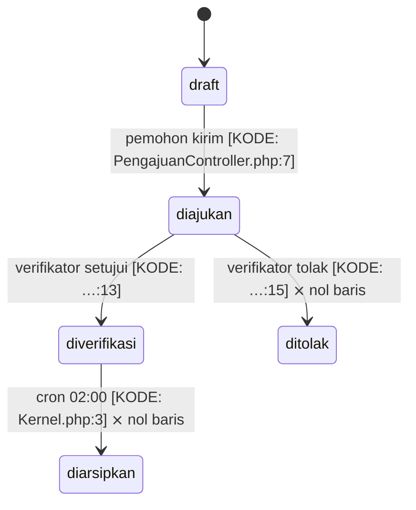

# Peta Isian — dari dosir bukti ke dokumen 00–27

Dibaca pada Fase 5, setelah `scaffold.py` mendirikan kerangka. Hukum 2 milik `vcbd` tetap berlaku
penuh: **satu fakta, satu rumah**. Dokumen lain hanya merujuk.

---

## 1. Peta pemilik fakta

| Dok | Diisi dari dosir | Catatan |
|---|---|---|
| `00`, `01`, `02`, `03` | — | Murni hasil wawancara kilat. Kode tidak menyimpan niat |
| `04_DOMAIN_MODEL` | `entitas[].nama`, istilah berulang di rute | Istilah domain, bukan skema |
| `05_USER_ROLE` | `peran[]` + `rute[].penjaga` | **Wajib** sertakan catatan kelengkapan bila banyak rute tanpa penjaga |
| `06_BUSINESS_PROCESS` | `mesin_status`, `proses_tak_kasat_mata`, `rute`, `kandidat_aturan` | Lihat §2 |
| `07_DATA_MODEL` | `entitas[]` + `bukti_data.tabel` | Kolom hasil introspeksi DB **menang** atas migrasi |
| `08_ARCHITECTURE` | `integrasi[]`, struktur folder | Pola arsitektur = `[USULAN]` kecuali jelas dari folder |
| `09_STACK` | `proyek.profil`, `dependensi[]` | Versi diambil dari lock/manifest, bukan ingatan |
| `10`, `11` | perintah baku per profil | Verifikasi perintah benar-benar ada di repo sebelum ditulis |
| `12_PROJECT_STRUCTURE` | pohon folder nyata | Rekam yang ADA, bukan yang seharusnya |
| `13_TESTING` | keberadaan folder tes | Brownfield sering kosong — tulis "tidak ada" apa adanya |
| `16_DEBUGGING_GUIDE` | `landmines[]` + temuan TINGGI | Rumah semua kejutan. Dokumen paling berharga di paket brownfield |
| `21_SECURITY_RULES` | temuan `sql_rangkai`, `berkas_tanpa_penjaga`, `data_sensitif[]` | Sebut kolom sensitif per nama; **jangan** sertakan contoh nilai |
| `23_ACCEPTANCE_CRITERIA` | alur di `06` | Tiap alur berbukti jadi satu kriteria terima yang bisa diuji |
| `26_UI_CONVENTIONS` | inventaris layar/view | Token diambil dari UI eksisting, bukan dikarang |
| `27_API_CONTRACT` (split) | `rute[]` ∩ `panggilan_api[]` | Endpoint hantu **tidak** ikut masuk kontrak — ia masuk `open_questions` |

---

## 2. Menulis `06_BUSINESS_PROCESS` — inti skill ini

Struktur per alur, urut dari alur berfrekuensi tertinggi:

```markdown
### A1 — Siklus Pengajuan Izin
**Pelaku**: pemohon, verifikator, sistem (terjadwal)
**Derajat bukti**: KODE+DATA



**Langkah happy path**
1. Pemohon mengisi formulir — validasi: nama wajib maks 100, NIK wajib 16 digit [KODE: …:4]
2. …

**Cabang gagal**: berkas > 2 MB ditolak [KODE: …:4] · …
**Aturan tertanam**: denda = 5.000 × hari telat [KODE: …:12] — dasar hukum [ISI:]
**Belum terbukti**: apakah `ditolak` benar-benar tidak pernah dipakai, atau dikerjakan di luar sistem
```

Aturan menulis yang mengikat:

1. **Jangan pernah mengubah himpunan nilai menjadi urutan tanpa bukti.** Urutan deklarasi enum boleh
   dipakai, tetapi ditandai `[USULAN]`. Sebaran data membuktikan nilai APA yang ada — bukan urutannya.
   Urutan baru berderajat DATA bila ada tabel audit/log yang merekam perpindahan.
2. **Tandai transisi yang nol baris dengan `⨯`**, jangan dihapus. Yang dihapus kehilangan jejak; yang
   ditandai memicu pertanyaan yang benar.
3. **Lajur (swimlane) diisi peran aplikasi**, bukan unit organisasi — dan tambahkan lajur "sistem"
   untuk proses terjadwal. Proses tak kasat mata yang tidak digambar adalah cara termudah membuat
   agen coding merusak aplikasi: ia tidak tahu ada cron yang ikut mengubah status.
4. **Satu alur = satu kriteria terima** di `23`. Bila sebuah alur tidak bisa dirumuskan jadi kriteria
   yang bisa diuji, alur itu belum cukup dipahami — tandai `[ISI:]`, jangan dipaksakan.
5. Skema tidak disalin ke sini (rumahnya `07`), peran tidak didefinisikan ulang (rumahnya `05`).

---

## 3. Mode PETA

Bila pengguna hanya minta peta proses: jalankan Fase 0–4 seperti biasa, lalu tulis **hanya**
`docs/06_BUSINESS_PROCESS.md` dengan bentuk di atas, ditambah satu blok pembuka berisi cakupan dan
derajat bukti. Jangan menjalankan `scaffold.py` — dokumen 06 yang berdiri sendiri tanpa 27 saudaranya
tidak melanggar apa pun, selama tidak berpura-pura menjadi paket blueprint.

---

## 4. Gerbang akhir

Setelah semua dokumen terisi:

```bash
bash <repo>/scripts/validate.sh
```

Bereskan tiap `[FAIL]` sebelum serah terima — termasuk sisa penanda `Status: KERANGKA`.
Lalu periksa satu hal terakhir secara manual, karena validator tidak bisa melihatnya:
**apakah ada kalimat pasti yang sebenarnya tebakan?** Bila ada, turunkan derajatnya ke `[USULAN]`.
Blueprint brownfield yang terlalu percaya diri lebih berbahaya daripada blueprint yang mengaku bolong.
