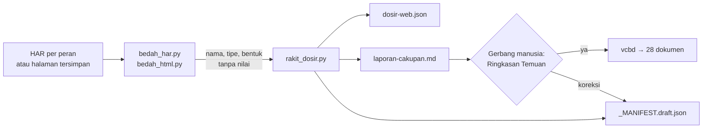

# reverse-web-vcbd

**Ubah aplikasi web yang hanya bisa Anda buka di peramban menjadi bahan blueprint siap-coding: berbukti, jujur cakupannya, dan bersih dari data pribadi.**

Vendor sudah pergi, kode tak pernah diserahkan, tetapi aplikasinya masih dipakai setiap hari dan harus ditulis ulang. `reverse-web-vcbd` adalah skill Claude yang membedah aplikasi seperti itu **dari luar**, dari lalu lintas peramban saat aplikasi dipakai secara wajar. Hasilnya adalah dosir bukti dan draf `_MANIFEST.json` yang langsung dipahami skill **vcbd** untuk disusun menjadi paket blueprint 28 dokumen.

```
reverse-web-vcbd  ──►  vcbd  ──►  coding-vcbd  ──►  review-vcbd
 (bukti dari luar)   (blueprint)   (bangun ulang)    (periksa)
```

---

## Daftar isi

- [Mengapa skill ini ada](#mengapa-skill-ini-ada)
- [Apa yang Anda dapatkan](#apa-yang-anda-dapatkan)
- [Contoh hasil nyata](#contoh-hasil-nyata)
- [Cara kerja](#cara-kerja)
- [Mulai cepat](#mulai-cepat)
- [Berkas keluaran](#berkas-keluaran)
- [Derajat bukti](#derajat-bukti)
- [Privasi dan keamanan](#privasi-dan-keamanan)
- [Batas yang perlu Anda ketahui](#batas-yang-perlu-anda-ketahui)
- [Memilih skill yang tepat](#memilih-skill-yang-tepat)
- [Struktur paket](#struktur-paket)
- [Pengujian](#pengujian)
- [Tanya jawab](#tanya-jawab)
- [Catatan perubahan](#catatan-perubahan)
- [Kredit](#kredit)

---

## Mengapa skill ini ada

"Reverse engineering" aplikasi web biasanya berakhir dengan salah satu dari dua cara:

1. **Manual**: berhari-hari mengklik menu, menyalin nama field ke spreadsheet, menebak alur persetujuan. Hasilnya tidak bisa diperiksa ulang dan cepat basi.
2. **Tangkapan layar ke AI**: cepat, tetapi model menulis tebakan dengan nada pasti. Agen coding di hilir lalu memperlakukan tebakan itu sebagai kebenaran.

`reverse-web-vcbd` mengambil jalan ketiga. **Mesin** membaca lalu lintas, **model** membaca ringkasan mesin, dan **manusia** mengisi hal yang hanya manusia tahu. Setiap fakta membawa label asal-usul, sehingga Anda selalu tahu mana yang terlihat, mana yang disimpulkan, dan mana yang masih kosong.

## Apa yang Anda dapatkan

| Kemampuan | Rinciannya |
|---|---|
| **Peta fitur** | Menu dan submenu per peran, halaman yang dikunjungi, serta halaman yang ditemukan tetapi belum dikunjungi |
| **Katalog endpoint** | Path bertemplat (`/cuti/{id}/setujui`), router query-string PHP native (`index.php?page=cuti&act=simpan`), Livewire dan GraphQL dipecah per komponen/operasi, status HTTP, dan bentuk payload |
| **Endpoint tersembunyi** | Endpoint dan rute SPA yang tertulis di bundle JS tetapi belum pernah diklik, berlabel `[AMATI-JS]` |
| **Matriks akses per peran** | Diringkas per modul × peran di laporan (`cuti: lihat, setujui, tolak`), rincian per endpoint di dosir, termasuk bukti larangan nyata (401/403) |
| **Formulir** | Field, tipe, wajib/tidak, `maxlength`, `min`/`max`, `accept`, label tampilan sebagai istilah domain, dan opsi `select` sebagai nilai enum |
| **Entitas teramati** | Atribut gabungan dari form, JSON, dan kolom tabel; relasi dari `*_id`, objek JSON bersarang, dan rute bersarang (`/pegawai/{id}/riwayat-jabatan`); penandaan field berdata pribadi |
| **Transisi status nyata** | Objek yang sama dilacak lintas peran lewat hash ID, sehingga `diajukan → disetujui oleh admin via POST /cuti/{id}/setujui` tercatat sebagai bukti, bukan tebakan. Status dibaca dari JSON, sel tabel, dan badge. |
| **Alur lintas peran** | Rantai peristiwa pada satu objek: `pegawai: buat cuti ⇒ admin: setujui cuti` |
| **Aturan validasi** | Teks pesan galat validasi yang lolos saring PII, misalnya "TMT tidak boleh mundur dari 2020-01-01", bahan dokumen 14 dan 23 |
| **Stack** | Petunjuk backend dari cookie dan header (Laravel, CodeIgniter, PHP native, Django, ASP.NET, dan lainnya), framework frontend, pustaka beserta versinya, dan DataTables server-side |
| **Pola arsitektur** | Server-rendered, SPA + API, atau hibrida, dihitung dari rasio respons HTML dan JSON |
| **Integrasi** | Domain pihak ketiga (misalnya SSO SIASN), dipisahkan dari CDN; subdomain milik aplikasi sendiri (`api.x.go.id`) otomatis dihitung internal |
| **Bentuk galat** | Amplop galat validasi dan otorisasi, bahan langsung untuk dokumen 14 |
| **Token UI** | CSS custom properties, warna dominan, dan font, bahan untuk dokumen 26 |
| **Temuan keamanan pasif** | Bendera cookie, header keamanan yang hilang, kebocoran versi server, form tanpa CSRF |
| **Jebakan (landmines)** | Hapus/setujui lewat GET (termasuk `?act=hapus`), galat yang datang dengan HTTP 200, perutean query-string, penamaan rute campur aduk |
| **Laporan cakupan jujur** | Persen halaman, form yang tak pernah dikirim, peran yang belum ditangkap |

## Contoh hasil nyata

Cuplikan dari fixture uji aplikasi cuti bergaya Laravel: HAR pegawai, HAR admin, dan satu halaman tersimpan dari operator, diproses dengan satu perintah.

```
[ok] cuti · peran 3 (admin, operator, pegawai)
     halaman 8/12 (67%) · endpoint 14 (+0 dari JS) · form 3/4
     modul 4 · entitas 2 · enum 6 · transisi 1 · alur lintas peran 2
     stack: Laravel, Laravel/Angular XSRF · pola Hibrida (halaman server + AJAX/JSON)
     ⚠ [AMATI] `GET /cuti/{id}/hapus` mengubah data lewat GET — jangan pernah di-prefetch/crawl
```

**Matriks akses per modul**, di mana `—` berarti *tidak teramati* dan `⛔` berarti *ditolak nyata*:

| Modul | admin | operator | pegawai |
|---|---|---|---|
| cuti | lihat, setujui, tolak | — | buat, create, hapus, lihat, ⛔403 |
| pengaturan | lihat | — | — |

**Transisi dan alur yang terbukti**, bukan ditebak dari nama tombol:

```
✅ cuti.status: diajukan → disetujui oleh admin via POST /cuti/{id}/setujui
   pegawai: buat cuti → 302 ⇒ admin: setujui cuti → 200
```

Fixture aplikasi PHP native menghasilkan endpoint seperti `GET /index.php?act=hapus&page=usulan` (lengkap dengan landmine-nya) dan `GET /profil/{slug}`. Fixture SPA menemukan `/v1/unor` dan `/v1/laporan/rekap` dari bundle JS, walaupun keduanya tidak pernah diklik.

Di semua fixture sengaja ditanam NIP, NIK, nama pegawai, slug nama bergelar, email, sandi, dan token sesi. **Tidak satu pun muncul** di keluaran mana pun, termasuk berkas bahan antara.

## Cara kerja



Skill berjalan dalam lima fase:

| Fase | Pelaku | Apa yang terjadi |
|---|---|---|
| **0 · Triase** | Claude + Anda | Memastikan kewenangan, peran yang ada, staging atau produksi. Bila bahan belum ada, Claude memandu cara menangkap HAR. |
| **1–2 · Bedah & rakit** | Skrip | Satu perintah `jalankan.py` membedah semua HAR dan folder halaman dengan garam hash yang sama, lalu merakit dosir, laporan, dan draf manifest, serta mencetak ringkasan ≤15 baris. HTML di dalam HAR dibedah di memori. |
| **3 · Tambal cakupan** | Claude + Anda | Bila cakupan rendah, Anda diminta menangkap ulang secara terarah, hanya untuk halaman dan form yang terlewat. Paling banyak dua putaran. |
| **4 · Gerbang** | Anda | Wawancara kilat untuk hal yang tak terlihat dari luar, lalu Ringkasan Temuan. Tidak ada serah terima tanpa jawaban "ya". |
| **5 · Serah ke vcbd** | Claude | vcbd dijalankan sebagai brownfield dengan pesan pembuka baku, sehingga hanya mewawancarai celah yang tersisa. |

**Kenapa hemat token**, dalam tiga lapis:

1. **Model tidak pernah membaca HAR.** Skrip membuang nilai dan hanya menyisakan nama, tipe, dan bentuk.
2. **Bacaan bertingkat.** Ringkasan stdout (≤15 baris) sering cukup untuk memutuskan langkah berikutnya. Laporan dibuka bila perlu, dan dosir hanya dikueri secara terarah.
3. **Laporan tumbuh per modul, bukan per endpoint.** Matriks digulung per modul, dan setiap daftar punya batas dengan penunjuk "… n lagi di dosir". Manifest tidak menyalin isi dosir.

Hasil terukur pada aplikasi sintetis 160 endpoint × 4 peran: laporan sekitar **2.300 token** (v1: sekitar 3.600), sementara dosir lengkapnya sekitar 33.000 token dan tetap tidak dibaca utuh. Satu proses penuh untuk berapa pun jumlah peran cukup dengan **satu** panggilan alat (v1: satu per HAR, ditambah satu).

## Mulai cepat

### 1. Pasang skill

Unggah `reverse-web-vcbd.skill` di claude.ai lalu klik **Save skill**. Untuk Claude Code, salin folder `reverse-web-vcbd/` ke direktori skill Anda.

Syarat: Python 3.8 atau lebih baru, **tanpa pustaka tambahan** (hanya pustaka standar).

### 2. Tangkap HAR, satu per peran

1. Buka jendela **Incognito**, tekan `F12`, lalu pilih tab **Network**.
2. Centang **Preserve log** dan **Disable cache**.
3. Login dengan akun peran pertama, lalu jelajahi: setiap menu, satu detail, setiap formulir, dan satu kali kirim formulir kosong.
4. Jalankan **satu alur utuh pada objek yang sama** secara berurutan: ajukan sebagai peran A, buka daftarnya, logout, lalu setujui sebagai peran B dan buka daftarnya lagi. Dari sinilah transisi status terbukti.
5. Klik kanan pada daftar permintaan, pilih **Save all as HAR with content**, dan simpan sebagai `pegawai.har`.
6. Logout, lalu ulangi untuk peran lain (`verifikator.har`, `admin.har`).

Panduan lengkap, termasuk hal yang **tidak boleh** diklik di produksi, ada di `references/panduan-tangkap.md`.

### 3. Minta Claude

> Ini HAR aplikasi cuti lama buatan vendor, dari akun pegawai dan admin. Kodenya tidak ada. Bedah jadi bahan blueprint vcbd, rencananya mau kami tulis ulang.

Skill terpicu otomatis oleh permintaan seperti "bedah HAR ini", "reverse engineering aplikasi web ini", "tiru aplikasi vendor ini", atau "petakan fitur aplikasi X".

### 4. Atau jalankan sendiri, satu perintah

```bash
python3 reverse-web-vcbd/scripts/jalankan.py --nama "SI-CUTI" --root ./proyek-baru \
    pegawai=pegawai.har admin=admin.har pegawai=pegawai-2.har operator=simpanan/operator/
```

- `peran=berkas.har` atau `peran=folder/` untuk halaman tersimpan; satu peran boleh muncul berkali-kali.
- Tambahkan `--origin host.lain.go.id` bila aplikasi memakai host di luar domain terdaftarnya.
- Proseslah **semua** bahan dalam satu perintah. Garam hash hanya hidup selama proses berjalan; memisahkan proses akan memutus korelasi objek lintas peran.

## Berkas keluaran

| Berkas | Untuk siapa | Isi |
|---|---|---|
| *stdout* `jalankan.py` | Model | Ringkasan ≤15 baris: cakupan, modul, transisi, stack, tiga temuan teratas, celah |
| `docs/_RECON_WEB/laporan-cakupan.md` | Manusia dan model | Ringkasan Temuan bertingkat modul dan berbatas: cakupan, matriks per modul, entitas, enum, transisi, alur, aturan validasi, endpoint JS, temuan, celah |
| `docs/_RECON_WEB/dosir-web.json` | Mesin dan audit | Buku bukti lengkap (JSON padat): matriks per endpoint, payload, enum, transisi, aturan validasi, token UI. Dikueri, tidak dibaca utuh, tidak disunting tangan. |
| `docs/_RECON_WEB/bahan/` | Mesin | Hasil bedah per berkas masukan, sudah tersaring PII |
| `docs/_MANIFEST.draft.json` | Skill vcbd | Draf ramping berskema vcbd §6: fitur, peran per modul, proses (alur objek didahulukan), entitas, stack, keamanan, landmine, pertanyaan terbuka. Enum, transisi, dan token UI lengkap tetap di dosir. |

Skrip **tidak pernah menimpa** `docs/_MANIFEST.json` yang sudah ada. Draf hanya menjadi manifest resmi setelah dikonfirmasi di Fase 2 vcbd.

## Derajat bukti

| Label | Arti | Contoh |
|---|---|---|
| `[AMATI: har:berkas#n]` | Terlihat langsung; bisa diperiksa ulang di entri HAR ke-n | `[AMATI: har:pegawai.har#12]` |
| `[AMATI-KORELASI]` | Objek yang sama terlihat berubah status atau disentuh lintas peran | `diajukan → disetujui oleh admin` |
| `[AMATI-JS]` | Tertulis di bundle JS, belum pernah dipanggil saat tangkap | `POST /v1/pegawai/{id}/mutasi` |
| `[AMATI-URUTAN]` | Urutan terjadi dalam sesi tangkap, belum tentu satu-satunya urutan bisnis | `GET /cuti/create ⇒ POST /cuti → 302` |
| `[INFER]` | Disimpulkan mesin dari bahan berbukti | `atasan_id → atasan` |
| `[USULAN]` | Rekonstruksi penalaran model | diagram status lengkap |
| `[ISI:]` | Hanya manusia yang tahu | tujuan aplikasi, skema DB fisik |

Aturannya sederhana: label tidak pernah naik derajat hanya karena kalimatnya terdengar masuk akal.

## Privasi dan keamanan

**Penyaringan dilakukan mesin, bukan kedisiplinan model.** `scripts/redaksi.py` bekerja seperti ini:

- Cookie, header `Authorization`, dan token CSRF: hanya **nama** dan bendera keamanannya (`HttpOnly`, `Secure`, `SameSite`) yang dicatat. Nilainya tidak pernah.
- Body permintaan dan respons: yang diambil hanya **nama field dan tipenya** (`str`, `int`, `date`, `datetime`, `file`).
- **ID objek tidak pernah keluar mentah.** Yang disimpan hanya hash 8 karakter dari garam acak, nama sumber daya, dan ID, sehingga `cuti#15` dan `pegawai#15` tidak tertukar. Garam hidup di memori satu proses dan tidak ditulis ke berkas mana pun.
- Nama rute (`page=cuti&act=simpan`) dan pesan validasi boleh lolos hanya setelah dicek terhadap pola PII.
- Nilai hanya boleh lolos bila kuncinya mirip enum (`status`, `jenis`, `peran`, ...), panjangnya paling banyak 40 karakter, dan tidak cocok dengan pola NIK, NIP, email, nomor telepon, JWT, atau token panjang.
- Opsi `select` yang merujuk entitas lain (`atasan_id`) atau berpotensi berisi nama orang hanya dicatat **jumlahnya**, bukan labelnya.
- Isi sel tabel dan teks bebas halaman tidak diambil, kecuali sel di kolom bermakna status/jenis yang lolos saring enum.
- Tautan di dalam konten disimpan **tanpa label**, karena labelnya sering nama orang. Label menu dibuang bila menunjuk objek atau berpola PII, dan judul halaman objek/profil dibuang.
- Angka di path (`/pegawai/199001012099011001`) menjadi `{id}`; UUID, hash, token, dan email juga ditemplatkan. **Slug nama orang** (`/profil/budi-santoso-spd`) menjadi `{slug}`, baik lewat gelar akademik, induk seperti `/profil`, maupun karena ada ≥3 nilai berbeda di posisi yang sama.

**Pasif dan berwenang.** Skill ini tidak melakukan fuzzing, menebak URL, brute force, atau memanggil endpoint di luar penjelajahan wajar. Temuan keamanan adalah efek samping pengamatan, bukan uji penetrasi. Skill hanya untuk aplikasi milik instansi Anda, buatan Anda sendiri, atau milik vendor yang kontraknya mengizinkan.

**Tanggung jawab Anda:** berkas HAR mentah tetap berisi data pribadi. Gunakan akun uji atau staging bila ada, pilih ekspor tersanitasi bila peramban menyediakannya, simpan HAR secara lokal, hapus setelah dibedah, dan logout setelah menangkap agar sesi di dalamnya tidak berlaku lagi.

## Batas yang perlu Anda ketahui

Kami lebih suka Anda kecewa sekarang daripada saat coding nanti.

| Terlihat dari peramban | **Tidak** terlihat dari peramban |
|---|---|
| Menu, halaman, formulir, tabel, tombol | Skema DB fisik: tipe kolom, indeks, constraint |
| Endpoint yang dipanggil saat dipakai, plus yang tertulis di bundle JS | Endpoint server yang tak dipicu dan tak dirujuk kode klien |
| Status HTTP dan bentuk galat yang terpicu | Aturan bisnis server yang tak terpicu saat tangkap |
| Nilai status yang muncul, dan transisinya bila objek yang sama diamati sebelum dan sesudah aksi | Status dan transisi yang tak pernah terjadi saat tangkap |
| Integrasi yang dipanggil dari peramban | Integrasi server-ke-server, cron, antrean, notifikasi |
| Pustaka dan framework frontend | Struktur folder, perintah build, lingkungan server |

Akibatnya, dokumen **07 yang lahir dari dosir ini adalah model antarmuka**, bukan skema database. Hal itu tertulis sebagai landmine pertama di manifest.

- **Untuk menulis ulang** aplikasi vendor atau aplikasi lama, dosir ini adalah spesifikasi perilaku yang kuat, dan skema baru dirancang ulang.
- **Untuk melanjutkan** aplikasi yang sama, dosir hanya separuh bukti. Dapatkan akses kode atau database, lalu gunakan `reverse-vcbd`.

Heuristik juga punya batas yang perlu diketahui:

- **Slug** satu kali kunjungan tanpa gelar dan tanpa induk seperti `/profil` (misalnya `/guru/ahmad-fauzi` yang hanya dibuka sekali) belum tertangkap. Daftar induk dan gelar ada di `redaksi.py` dan mudah ditambah.
- **Router** dengan nama parameter tak lazim (misalnya `?hal=`) perlu ditambahkan ke daftar `ROUTER`.
- **Korelasi objek** butuh HAR yang ditangkap berurutan waktu dan diproses dalam satu perintah.
- **Pemindai JS** membaca pola umum (`axios`, `fetch`, `$.get`, rute `path:`). URL yang dirakit dari variabel (`baseURL + seg`) tidak terbaca.

Laporan cakupan menunjukkan celah ini apa adanya, bukan menyembunyikannya.

## Memilih skill yang tepat

| Situasi Anda | Pakai |
|---|---|
| Hanya bisa membuka aplikasi lewat peramban | **reverse-web-vcbd** |
| Punya repo kode (Laravel, PHP native, Flutter) | `reverse-vcbd` |
| Proyek baru dari nol | `vcbd` |
| Blueprint sudah ada, saatnya membangun | `coding-vcbd` |
| Aplikasi sudah dibangun, saatnya diperiksa | `review-vcbd` |

Keduanya boleh digabung. Kalau Anda punya kode backend tetapi frontend-nya di tangan vendor, jalankan `reverse-vcbd` untuk sisi server dan skill ini untuk sisi peramban.

## Struktur paket

```
reverse-web-vcbd/
├── SKILL.md                     # alur lima fase, lima hukum, anti-pattern
├── README.md                    # berkas ini
├── references/
│   ├── panduan-tangkap.md       # menangkap HAR per peran, rencana jelajah, etika, mode JELAJAH
│   └── peta-dosir.md            # derajat bukti, peta dosir→manifest→dokumen, wawancara kilat, serah ke vcbd
├── scripts/
│   ├── jalankan.py              # satu perintah: semua peran, garam bersama, ringkasan ≤15 baris
│   ├── redaksi.py               # penegak privasi + templat: slug, router query, domain, hash ID
│   ├── bedah_har.py             # HAR → endpoint, payload, enum, keadaan objek, validasi, JS, stack
│   ├── bedah_html.py            # HTML → menu, form, tabel+status, badge, aksi, jejak framework, token CSS
│   └── rakit_dosir.py           # gabung → matriks modul, transisi, alur objek, dosir, laporan, manifest
├── uji/
│   ├── buat_fixture.py          # pembangkit fixture 4 gaya: Laravel MPA · PHP native · SPA+API subdomain · Livewire v3
│   └── uji_regresi.py           # 32 cek mesin; wajib lulus setelah mengubah skrip
└── evals/evals.json             # skenario uji perilaku (artefak pengembangan, tidak ikut paket)
```

## Pengujian

`uji/uji_regresi.py` membangkitkan fixture empat gaya aplikasi, menjalankan pipeline penuh, dan memeriksa **32 perilaku** secara mesin.

```bash
python3 uji/uji_regresi.py      # 32/32 lulus · kode keluar 1 bila ada yang gagal
```

| Kelompok | Yang dibuktikan |
|---|---|
| **Laravel MPA, 3 peran** | Transisi diajukan→disetujui oleh admin, alur lintas peran, 403 di matriks, pesan validasi, status dari badge, landmine hapus-lewat-GET, atribusi menu per peran, tidak ada positif palsu XSRF |
| **PHP native** | Router `page`/`act` dipertahankan, paginasi `p=2` bukan rute, slug nama → `{slug}`, landmine `?act=hapus`, entitas dari router, status dan transisi dari sel tabel |
| **SPA + API subdomain** | Subdomain dihitung internal, entitas JSON bersarang, entitas rute bersarang, endpoint dan rute dari bundle JS, pesan validasi, saran SPLIT |
| **Livewire v3** | Satu endpoint `/livewire/update` dipecah per `komponen.metode` |
| **Privasi** | Nol PII/rahasia di **semua** keluaran, termasuk bahan antara |
| **Token & skala** | Manifest tidak menyalin dosir; 160 endpoint → 40 baris matriks; laporan aplikasi besar ≤ 4.000 token; ID sama di modul berbeda tidak dilebur |

**Serah ke vcbd** juga diuji: draf manifest dijalankan ke `scaffold.py` dan `validate.sh` milik vcbd, dan cek 1, 2, 3, 4, 5, 7, 9, 10, 11 lulus. Satu-satunya FAIL adalah cek 8 (dokumen masih kerangka), yang memang tugas vcbd untuk mengisinya.

Semua fixture adalah buatan; HAR dari aplikasi pemda sungguhan tetap menjadi uji yang paling jujur.

## Tanya jawab

**Kantor melarang DevTools. Masih bisa?**
Bisa, dengan hasil lebih tipis. Simpan halaman lewat `Ctrl+S` (*Webpage, HTML only*), satu folder per peran, lalu gunakan `bedah_html.py`. Menu, formulir, tabel, dan tombol akan terbaca. Endpoint AJAX, status HTTP, dan urutan langkah tidak akan terbaca, dan laporan akan menyatakannya dengan jelas.

**Apakah Claude bisa menjelajah sendiri lewat Claude in Chrome?**
Bisa, secara terbatas: hanya mengklik menu navigasi pada sesi yang sudah Anda loginkan, tanpa mengirim formulir dan tanpa mengklik tombol aksi. Mode ini cocok untuk memandu dan memverifikasi, bukan pengganti HAR, karena lalu lintas AJAX tidak tertangkap.

**Aplikasinya SPA (React/Vue) dengan API JSON. Cocok?**
Justru sangat cocok. Hampir semua logika terlihat sebagai panggilan API. Skill akan menyarankan mode **SPLIT** vcbd, dan endpoint dari dosir menjadi bahan awal `kontrak/openapi.yaml`.

**Aplikasinya PHP native dengan `index.php?page=...`. Cocok?**
Cocok, dan inilah kasus yang paling diperkuat di v2. Setiap kombinasi `page`/`act` menjadi endpoint tersendiri, `page` menjadi nama modul, dan aksi berbahaya lewat GET (`act=hapus`) masuk landmine.

**Bagaimana dengan Livewire atau GraphQL yang semuanya lewat satu URL?**
Lalu lintasnya dipecah otomatis per komponen dan metode (`/livewire/update#laporan.form-aduan.simpan`) atau per nama operasi GraphQL.

**Berapa lama menangkap HAR?**
Sekitar 15–30 menit per peran untuk aplikasi berukuran sedang. Yang paling menentukan kualitas adalah menjalankan satu alur utuh lintas peran, karena hanya dengan cara itu siklus status bisa teramati.

**Apakah hasilnya bisa langsung dipakai coding?**
Belum. Dosir adalah bahan, bukan blueprint. vcbd masih akan menanyakan hal yang tak terlihat dari luar (lingkungan, perintah, struktur, tes, rilis), lalu menyusun 28 dokumen yang tervalidasi. Karena faktanya sudah terkumpul, konfirmasi di vcbd biasanya cukup satu putaran.

## Catatan perubahan

**v2.0**
- Privasi: slug nama orang di path menjadi `{slug}`; label tautan konten dan judul halaman objek dibuang; ID hanya sebagai hash bergaram per sumber daya.
- Cakupan: router query-string PHP native, subdomain se-domain terdaftar, Livewire v2/v3, GraphQL, endpoint dan rute dari bundle JS.
- Mutu: transisi status terbukti lewat korelasi objek lintas peran; status dari sel tabel dan badge; entitas bersarang dari JSON dan rute; pesan validasi.
- Token: `jalankan.py` satu perintah dengan ringkasan ≤15 baris; laporan per modul dan berbatas; manifest tidak menyalin dosir; dosir JSON padat; cakupan "n/a" bila tak ada halaman HTML.
- Pengujian: fixture empat gaya aplikasi dan 32 cek regresi.

**v1.0** — rilis awal: bedah HAR dan halaman tersimpan, dosir, laporan cakupan, draf manifest vcbd.

## Kredit

Disusun oleh **Syamsuddin, S.Pd, MM** (syamsuddin.ideris@gmail.com) sebagai bagian dari keluarga skill VCBD, untuk kebutuhan modernisasi aplikasi pemerintah daerah: dari aplikasi warisan yang hanya bisa dibuka di peramban, menjadi blueprint yang siap dibangun ulang dengan aman.

Lisensi: [ISI: ikuti lisensi keluarga skill VCBD atau tetapkan lisensi tersendiri]
